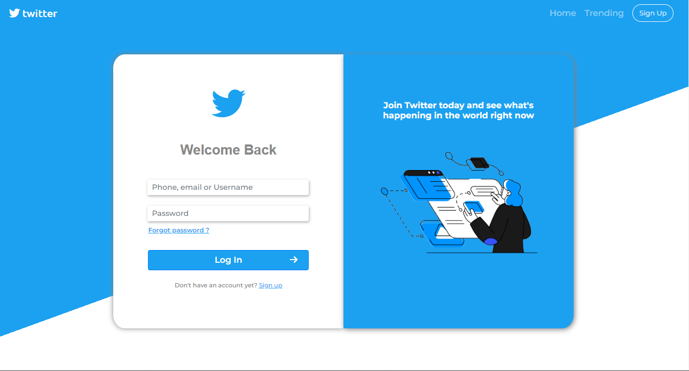

 

# Twitter Login Screen

I saw a Twitter Login Screen Concept by **Nel John Bayalas** on [**Dribbble**](https://dribbble.com/shots/15009688-Twitter-Login-Page-Redesign). 

I Liked the Layout and concept and Thought Why Not To Recreate it Into an Actual Webpage.
Hence, I made a Webpage using Bootstrap as a Challenege to myself.

And Here is What I was Able to Make....

 Here it is in Action :

Go have a look yourself : [Login page](https://aryanshdev.github.io/Twitter-Login/)